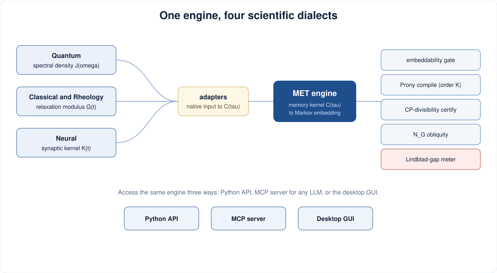
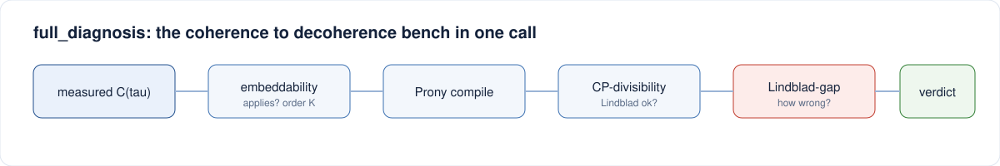

<p align="center">
  
</p>

<p align="center">
  <a href="https://doi.org/10.5281/zenodo.20557167"></a>
  <a href="./LICENSE"></a>
  
  <a href="https://github.com/hopenmind/metcore/releases/latest"></a>
</p>

> **Metcore answers one expensive question: does the memory of your system
> actually matter - and is heavy non-Markovian computation worth it?**
> Before committing weeks of simulation (HEOM, pseudomodes, TEDOPA, quantum
> hardware) or silently accepting the Markovian shortcut (Lindblad), measure
> the answer instead of guessing it. Every verdict is a number you can cite -
> not a community convention. One mathematical engine (the Markov Embedding
> Theorem), usable across quantum, classical, rheological and neural problems,
> reachable three ways: a desktop app, an MCP server for any LLM, a Python
> library.

## Pick your path

| I want to ... | Go to |
|---------------|-------|
| Download a ready-to-run app for my computer | [1. Download the app](#1-download-the-app) |
| Plug the tools into my LLM (Claude, Cursor, VS Code, ...) | [2. Use it as an MCP server](#2-use-it-as-an-mcp-server) |
| Install the library and build on it | [3. Developer install](#3-developer-install) |
| Understand the science | [4. The science, with examples](#4-the-science-with-examples) |

---

## 1. Download the app

No Python, no setup. Download the file for your hardware from the
**[latest release](https://github.com/hopenmind/metcore/releases/latest)**, then run it.

| Operating system | Hardware | Download |
|------------------|----------|----------|
| Windows | any (installer, recommended) | [metcore-setup.exe](https://github.com/hopenmind/metcore/releases/latest/download/metcore-setup.exe) |
| Windows | x86_64 (portable) | [metcore-windows-x86_64.exe](https://github.com/hopenmind/metcore/releases/latest/download/metcore-windows-x86_64.exe) |
| macOS | Apple Silicon (M1/M2/M3) | [metcore-macos-arm64.dmg](https://github.com/hopenmind/metcore/releases/latest/download/metcore-macos-arm64.dmg) |
| macOS | Intel | [metcore-macos-x86_64.dmg](https://github.com/hopenmind/metcore/releases/latest/download/metcore-macos-x86_64.dmg) |
| Linux | x86_64 | [metcore-linux-x86_64.AppImage](https://github.com/hopenmind/metcore/releases/latest/download/metcore-linux-x86_64.AppImage) |
| Linux | arm64 | [metcore-linux-arm64.AppImage](https://github.com/hopenmind/metcore/releases/latest/download/metcore-linux-arm64.AppImage) |

> On Windows the installer adds a Start Menu shortcut and an uninstaller. On
> macOS, open the .dmg and drag Metcore to Applications. On Linux, make the
> .AppImage executable once (chmod +x) and run it.

### What the app actually does

Five specialty tabs, one engine:

- **Quantum** - spectral density J(omega) -> bath correlation -> full
  non-Markovian diagnosis.
- **Classical & Rheology** - Maxwell-Wiechert / Prony relaxation spectrum of a
  measured modulus G(t), with principled (MaxEnt) order selection.
- **Neural** - retarded synaptic / dendritic kernels -> diagnosis.
- **Diagnostics** - geometric non-Markovianity N_G of qubit channels.
- **Shortcuts** - closed-form, one-stroke answers where the normal route is
  hours of simulation: asymptotic Lindblad rate gamma_M from Prony data, the
  memory-modified Kuramoto synchronization threshold K_c(M), the resonance
  line shape of the threshold shift, reaction-time scaling from kernel
  parameters.

Everywhere, the same workflow comforts: **Live update** (figures recompute as
you move parameters), an **embedded value table** painted into the figure
(checkbox, row count of your choice - what you see is what you export),
**right-click on any figure** for 7 academic image formats (PNG 300/600, PDF,
SVG, EPS, TIFF 300/600), CSV / Excel of the exact plotted numbers, an XML data
sidecar, or an image with the value table embedded. **Tools > Batch
processing** runs a CSV of parameter sets in one go and writes images + data
per job. **Edit > Branding & colors** puts your lab's logo, header and brand
colors (10 academic presets or your two hex codes) on everything; **Edit >
Preferences** persists your defaults. **? > Tutorial** explains the decision
pipeline from inside the app.

---

## 2. Use it as an MCP server

The suite ships an MCP server named "metcore" exposing seventeen tools to any
Model Context Protocol client (Claude Desktop, Claude Code, Cursor, VS Code,
Windsurf, Cline, and local or professional LLM front-ends).

```bash
pip install metcore-mcp
python scripts/setup_mcp.py        # guided installer (a short questionnaire)
```

Prefer to do it by hand? Add this to your client's MCP config:

```json
{ "mcpServers": { "metcore": { "command": "metcore-mcp", "args": ["serve"] } } }
```

### The seventeen tools and what they are for

**Diagnosis - "does memory matter here?"**

| Tool | Question it answers |
|------|---------------------|
| `suite_info` | What is live in this deployment? Run it first. |
| `kernel_embeddability` | Is my kernel rational (finite memory, MET applies) or power-law / sub-ohmic? The scope gate. |
| `prony_decompose` | What are the memory modes, and the embedding order K (= the compute bill of an exact treatment)? |
| `maxent_select_order` | Which Prony order K, chosen by maximum entropy instead of an ad-hoc cutoff? |
| `cptp_certify` | Is a Markovian (Lindblad) description even admissible, and on which time windows does it break? |
| `lindblad_gap` | If I use Lindblad anyway, how wrong is it - peak and integrated error over time? |
| `nonmarkovianity_ng` | How much memory is there, as one geometric number N_G (0 = Markovian)? |
| `full_diagnosis` | All of the above in one call, with a plain-language verdict. If you run one thing, run this. |
| `kernel_zoo` | Give me canonical benchmark kernels (drude, underdamped, subohmic, ...) to feed the other tools. |

**Analytic shortcuts - one stroke instead of hours of simulation**

| Tool | Replaces |
|------|----------|
| `exterior_lindblad_rate` | Integrating the full Nakajima-Zwanzig dynamics to t -> infinity: gamma_M = Re sum alpha_k/beta_k, < 1 ms. |
| `kuramoto_critical_coupling` | A coupling sweep + transition fit of the retarded Kuramoto model: K_c(M) = 2 gamma_g / M_hat(0). |
| `rf_resonance_shift` | Re-running the threshold sweep at every perturbation frequency: a Lorentzian line shape, O(1) per frequency. |
| `reaction_time_scaling` | A behavioral reaction-time campaign, when only the scaling is needed: RT = tau_l + tau_d ln(theta/I0). |

**Output and branding - the same files and identity as the desktop app**

| Tool | What it does |
|------|--------------|
| `export_formats` | List every output `export_curve` can write (7 image formats + csv / xlsx / xml / image_table). |
| `export_curve` | Write named columns to disk in any subset of those formats, themed and branded. |
| `branding_get` | Read the current branding + color theme and the conventions (same file the app edits: ~/.metcore/branding.json). |
| `branding_set` | Apply branding/theme changes (presets or hex colors, logo, header); every next render follows. |

The full client-by-client matrix is in [MCP_DEPLOYMENT.md](./MCP_DEPLOYMENT.md).

---

## 3. Developer install

```bash
pip install metcore                 # the library + MCP server
# or, from a checkout, for the whole workspace:
git clone https://github.com/hopenmind/metcore
cd metcore
uv sync --all-packages
uv run pytest
```

```python
import numpy as np
from memkern import full_diagnosis, zoo

k = zoo.get_kernel("underdamped")
tau = np.linspace(0, 25, 800)
print(full_diagnosis(tau, k.C(tau), t_max=25)["summary"])
```

Full API and CLI reference: [USAGE.md](./USAGE.md). To build the desktop app
yourself, run "python packaging/build_exe.py" on the target machine; tagged
pushes (v*) build all six binaries in CI and attach them to the release.

---

## 4. The science, with examples

<p align="center">
  
</p>

The suite rests on the **Markov Embedding Theorem**: any memory described by a
rational kernel is exactly equivalent to a memoryless (Markovian) system in a
slightly larger space. From a measured kernel C(tau), the pipeline checks whether
the theory applies, compiles the memory into modes, certifies whether a Lindblad
description is admissible, and measures the memory geometrically.

<p align="center">
  
</p>

```python
from memkern import zoo, full_diagnosis
import numpy as np

# a well-behaved bath: the Markovian model is exact
tau = np.linspace(0, 15, 300)
print(full_diagnosis(tau, zoo.get_kernel("drude").C(tau))["summary"])

# an oscillating bath: memory breaks the Markovian picture, lindblad_gap measures it
k = zoo.get_kernel("underdamped", w0=3.0, gamma=0.15)
t = np.linspace(0, 30, 1000)
r = full_diagnosis(t, k.C(t), t_max=30)
print(r["steps"]["cptp"]["cp_divisible"], r["steps"]["lindblad_gap"]["integrated_gap"])
```

Cross-domain, same engine:

```python
from memkern.adapters import quantum_kernel, neural_kernel
from memkern.shortcuts import exterior_rate, kuramoto_kc

tau, C = quantum_kernel("ohmic", T=0.3, lam=1.0, wc=4.0)   # quantum: J(omega)
t,   K = neural_kernel(tau_rise=0.3, tau_decay=3.0)         # neural: synaptic kernel
print(exterior_rate([1.0, 0.5], [0.5, 3.0])["gamma_markov"])  # one stroke
```

---

## Repository layout

```text
metcore/
  README.md  USAGE.md  MCP_DEPLOYMENT.md  CHANGELOG.md
  CONTRIBUTING.md  CODE_OF_CONDUCT.md  SECURITY.md  LICENSE  CITATION.cff
  pyproject.toml
  docs/assets/            logo, icon, presentation SVGs
  packaging/              desktop-app build (PyInstaller spec + driver + icons)
  installer/              Windows installer script (Inno Setup)
  scripts/                guided MCP installer (setup_mcp.py)
  examples/               batch-job CSV examples
  .github/                issue/PR templates, tag-driven multi-OS build CI
  packages/
    memkern/              the MET engine: Prony, diagnostics, shortcuts, adapters
    obliquity-ng/         geometric non-Markovianity N_G
    boltz-kernel/         open-quantum-systems adapter
    memkern-rheology/     viscoelastic relaxation adapter
    metcore-mcp/          the unified MCP server (17 tools)
    metcore-gui/          the desktop app (5 specialty tabs)
    metcore-export/       branded multi-format figure + data export, themes
    metcore-cli/          the unified command line
```

## Citing and license

Cite via [CITATION.cff](./CITATION.cff) or the DOI
[10.5281/zenodo.20557167](https://doi.org/10.5281/zenodo.20557167). Dual-licensed:
Apache-2.0 OR LicenseRef-HopenMind-Commercial (see [LICENSE](./LICENSE)).

<p align="center"><sub>DESVAUX G.J.Y.  -  Hope 'n Mind SASU, Research  -  contact@hopenmind.com</sub></p>
